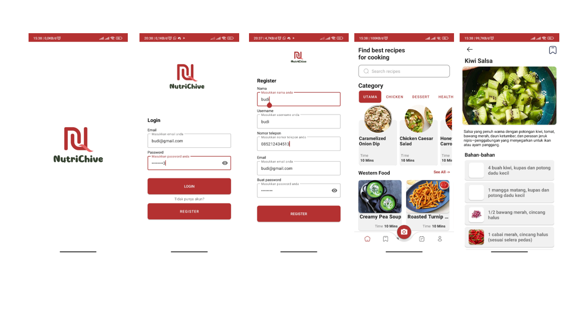
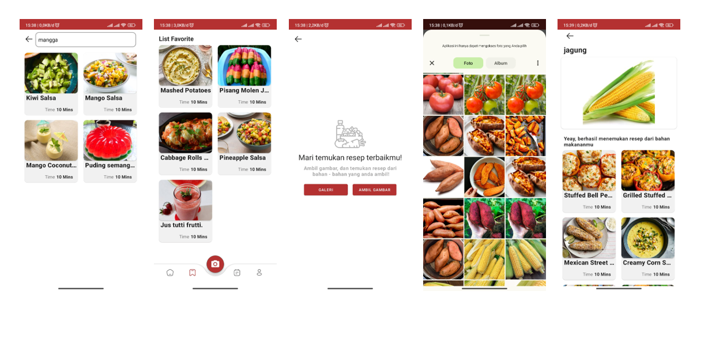

# NutriChive : Food Ingredient, Recipe, and Nutrition Archive
The Food Ingredient Identification and Recipe Recommendation Mobile Application that helps users identify various food ingredients according to the data we have trained with our model through the user's smartphone's camera or uploaded photos.

## Kelompok CH2-PS174

| No | Path             | Name                               | University                                 | GitHub Profile                                |
|----|------------------|------------------------------------|--------------------------------------------|-----------------------------------------------|
| 1  | (ML) M312BSY0473 | Andika Kavin Septiano               | Universitas Sebelas Maret                  | [ndkvin](https://github.com/ndkvin)             |
| 2  | (ML) M312BSY0914 | Muhammad Anang Fathur Rohman        | Universitas Sebelas Maret                  | [anangfathh](https://github.com/anangfathh)    |
| 3  | (ML) M312BSY1043 | Mohammad Al Furqon                  | Universitas Sebelas Maret                  | [Alfurqon02](https://github.com/Alfurqon02)    |
| 4  | (CC) C157BSY4206 | Dani Hidayat                         | Universitas Mayasari Bakti                 | [DaniHidayat](https://github.com/DaniHidayat)  |
| 5  | (CC) C183BSY3336 | Iqbal Dwi Nur Khoirul Anam           | Universitas Amikom Yogyakarta              | [iqbaldwinur](https://github.com/iqbaldwinur)  |
| 6  | (MD) A157BSY2857 | Agung Muhammad Albaehaqi             | Universitas Mayasari Bakti                 | [agung-bae14](https://github.com/agung-bae14) |
| 7  | (MD) A296BSX2632 | Aisyatuz Zahroh                      | Universitas Pembangunan Nasional Veteran Jawa Timur | [Aisyatuzz](https://github.com/Aisyatuzz)  |

## Mobile Development Documentation




This repository contains the Android app for the NutriChive project, developed using Kotlin to fulfill the requirements of the Bangkit Capstone Project.

- ### Features
  - **Home:** The central hub of the app, providing users with a curated selection of recipes for a delightful and convenient browsing experience.

  - **Search:** Swiftly find specific recipes or explore a variety of options based on individual preferences, enhancing the app's usability.

  - **Detail Recipe:** Immerse yourself in the intricate details of each recipe, including ingredients, cooking instructions, for a comprehensive and informative cooking guide.

  - **Take Image from Gallery or Camera:** Capture food ingredients seamlessly by choosing images from your device gallery or utilizing the camera feature, ensuring a user-friendly experience.
  - **Food Prediction Results:** Leverage the app's advanced technology to predict and display accurate results for detected food ingredients, facilitating efficient meal preparation.

  - **Login:** Ensure secure access to personalized features by providing a user-friendly login interface, enhancing the app's privacy and customization.

  - **Register:** Empower users to create personalized accounts independently, unlocking additional functionalities and contributing to a seamless user experience.

  - **Save Recipe:** Allow users to save their favorite recipes for future reference, creating a personalized collection and fostering user engagement.

These features collectively contribute to an enriching and comprehensive user experience, catering to the diverse needs of individuals passionate about cooking and exploring new recipes.
- ### Dependencies
  - Lifecycle & Livedata
  - DataStore
  - Navigation Component
  - kotlinx-coroutines
  - Tensorflow Lite
  - Glide
  - Retrofit 2
  - Shimmer Android

## Clone the Repository
1. Open Android Studio on your computer.
2. Click on "Get from Version Control" in the welcome screen.
3. Choose Git as the version control system.
4. Copy the repository URL of the project you want to clone.

   ```bash
   https://github.com/Team-Bangkit-Capstone-CH2-PS174/nutriChive.git
   ```

5. Paste the URL in the "URL" field of Android Studio.
6. Select a directory on your machine where you want to save the project.
7. Click on "Clone" to initiate the cloning process.
